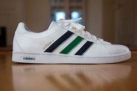

# Product_card
## Date:
## Objective:

To replicate a product card layout similar to those found on real-time e-commerce platform like FlipKart using the CSS Box Model (margin, border, padding, and content).

## Tasks:

#### 1. Structure the HTML Layout:
Create a container ```<div>``` for the product card.

Add an `````` for the product image.

Include ```<h2>``` for product name, ```<p>``` for description, and a ```<span>``` or ```<div>``` for price.

Add a “Buy Now” or “Add to Cart” button.

#### 2. Apply Box Model Styling in CSS:
Use padding inside each section (image, text, button) to ensure readability.

Use margin around the card to space it from the page edges or other cards.

Add a border to outline the card.

Control width and height for consistent sizing.

#### 3. Visual Styling:
Add a background color to the card container.

Use box-shadow to simulate depth (card lifting effect).

Add border-radius for rounded corners.

#### 4. Center the Card:
Use display: flex and justify-content: center and align-items: center on the parent container.

#### 5. Bonus Enhancements:
Use a hover effect on the button (e.g., background color change).

Make the card responsive with percentage-based widths or media queries.
## HTML Code:
```
<!DOCTYPE html>
<html lang="en">
<head>
  <meta charset="UTF-8" />
  <meta name="viewport" content="width=device-width, initial-scale=1.0" />
  <title>Flipkart</title>
  <link href="style.css" rel="stylesheet" />
</head>
<body>
  <div class="container">
    <div class="div1">
      <div class="div11">
        <h6></h6>
        <h2>FLIPKART</h2>
        <p>Explore Plus</p>
      </div>
      <div class="div12">
        <input type="text" placeholder="Search for Products and more" />
      </div>
      <div class="div13">
        
      </div>
    </div>

    <div class="div2">
      <div class="show"><p>Smart phone</p></div>
          <div class="show"><p>Airbuds</p></div>
          <div class="show"><p>DSLR Camera</p></div>
          <div class="show"><p>Men's Shirts</p></div>
          <div class="show"><p>Sneakers</p></div>
    </div>

    <div class="div3">
      
    </div>

    <div class="div4">
      <div class="div41">
        <div class="div411">
          <h2>Deals of the Day</h2>
          <p>08 H:02 M:53 S Left</p>
          <button aria-label="View all deals of the day">View ALL</button>
        </div>
        <div class="div412">
          <div class="show"><p>Smart Watches</p></div>
          <div class="show"><p>Smart Phone</p></div>
          <div class="show"><p>Shirts for Men</p></div>
          <div class="show"><p>Baby dolls</p></div>
          <div class="show"><p>Shoes for Men</p></div>
        </div>
      </div>
      <div class="div42">
        <div class="show">
          
          <p>Go to Cart</p>
        </div>
      </div>
    </div>
  </div>
</body>
</html>
```

## CSS Code:
```
@import url('https://fonts.googleapis.com/css2?family=Poppins:wght@300;500;700&display=swap');

* {
  margin: 0;
  padding: 0;
  font-family: 'Poppins', sans-serif;
  color: #333;
}

body {
  background-color: white;
}

.container {
  display: flex;
  flex-direction: column;
  padding: 0;
}

/* Top Header */
.div1 {
  display: flex;
  justify-content: space-around;
  align-items: center;
  background-color: darkblue;
  padding: 1.5%;
  border-radius: 1%;
}

.div11 h2 {
  font-style: italic;
  font-size: 24px;
  color: #1a73e8;
}

.div11 p {
  font-size: 14px;
  font-weight: 500;
  color: #fff;
  background-color: yellow;
  color:black;
  font-weight: 900;
}

.div12 input {
  width: 300px;
  height: 20px;
  padding: 10px;
  font-size: 18px;
  border: 1px solid #ccc;
  border-radius: 6px;
  background-color: #f9f9f9;
}

.div13 img {
  border: 1px solid white;
  border-radius: 100%;
  margin-top: 10px;
  background-color: white;
}

/* Product Navigation Tiles */
.div2 {
  display: flex;
  justify-content: space-around;
  padding: 10px 5px;
  margin: 20px;
}

.show {
  display: flex;
  flex-direction: column;
  align-items: center;
  gap: 6px;
  margin: 0 10px;
}

.show img {
  width: 100px;
  height: 100px;
  object-fit: cover;
  border-radius: 6px;
}

.show p {
  font-size: 15px;
  font-weight: 500;
  color: #222;
  text-align: center;
}

/* Center Image */
.div3 {
  display: flex;
  justify-content: center;
  margin-top: 80px;
}

.image {
  width: 100%;
  max-height: 400px;
  object-fit: cover;
  border-radius: 10px;
}

/* Deals Section */
.div4 {
  display: flex;
  justify-content: space-between;
  align-items: flex-start;
  padding: 20px;
  gap: 20px;
}

.div41 {
  background-color: rgba(173, 173, 184, 0.67);
  border: 1px solid white;
  border-radius: 2%;
  padding: 10px;
}

.div411 {
  display: flex;
  justify-content: space-around;
  align-items: center;
  margin-bottom: 10px;
}

.div412 {
  display: flex;
  flex-wrap: wrap;
  justify-content: space-around;
  padding: 20px 5px;
}

.div412 .show {
  margin-bottom: 20px;
}

/* Furniture Tile */
.div42 {
  display: flex;
  align-items: flex-start;
  border: 1px solid white;
  border-radius: 2%;
  margin-top: 20px;
}

.div42 img {
  width: 250px;
  border-radius: 10px;
}

/* Button Style */
button {
  padding: 10px 22px;
  font-size: 15px;
  font-weight: 600;
  background-color: #007BFF;
  color: white;
  border: none;
  border-radius: 6px;
  box-shadow: 0 2px 6px rgba(0,0,0,0.2);
  cursor: pointer;
  transition: all 0.3s ease;
}

button:hover {
  background-color: #0056b3;
  transform: translateY(-2px);
}

/* Headings */
h2 {
  font-size: 22px;
  font-weight: 600;
  color: #1a73e8;
}
```

## Output:


## Result:
A product card layout similar to those found on real-time e-commerce platform like FlipKart using the CSS Box Model is replicated successfully.
